<p align="center">
  
</p>

# @git-fabric/cve

CVE detection-to-remediation fabric app. Scan, enrich, triage, and fix vulnerabilities across managed repos — autonomously.

Part of the [git-fabric](https://github.com/git-fabric) ecosystem.

## Architecture

Five composable layers, each independently consumable:

```
Detection  →  Intelligence  →  Decision  →  Action  →  State
   │               │              │            │          │
   │  Scan deps    │  NVD enrich  │  Policy    │  Branch  │  JSONL queue
   │  query GHSA   │  CVSS/CWE    │  triage    │  commit  │  dedup
   │               │              │  plans     │  PR      │  stats
   └───────────────┴──────────────┴────────────┴──────────┴──────────
```

| Layer | What it does | Side effects? |
|-------|-------------|---------------|
| **Detection** | Reads dependency manifests, queries GitHub Advisory Database | No (produces findings) |
| **Intelligence** | Enriches CVEs from NVD with CVSS scores, status, CWE | No (pure data transform) |
| **Decision** | Applies severity policy, produces triage plans | No (pure logic) |
| **Action** | Creates branches, commits dependency bumps, opens PRs | Yes (writes to GitHub) |
| **State** | Manages the CVE queue (JSONL), dedup, filtering, stats | Yes (writes to state repo) |

## Quick Start

### As an MCP Server

```bash
# Set environment
export GITHUB_TOKEN="ghp_..."
export STATE_REPO="ry-ops/git-steer-state"
export MANAGED_REPOS="ry-ops/git-steer,ry-ops/blog"

# Start MCP server (stdio)
npx @git-fabric/cve start
```

### Claude Desktop Config

```json
{
  "mcpServers": {
    "git-fabric-cve": {
      "command": "npx",
      "args": ["@git-fabric/cve", "start"],
      "env": {
        "GITHUB_TOKEN": "ghp_...",
        "STATE_REPO": "ry-ops/git-steer-state",
        "MANAGED_REPOS": "ry-ops/git-steer,ry-ops/blog"
      }
    }
  }
}
```

### CLI

```bash
# Scan repos for vulnerable deps
fabric-cve scan --severity-threshold HIGH

# Enrich a single CVE from NVD
fabric-cve enrich CVE-2024-45519

# Triage pending queue entries (dry run)
fabric-cve triage --dry-run true

# Queue operations
fabric-cve queue list --status pending
fabric-cve queue stats
```

## MCP Tools

| Tool | Description |
|------|-------------|
| `cve_scan` | Scan managed repos for vulnerable dependencies via GHSA |
| `cve_enrich` | Fetch enriched details for a CVE from NVD |
| `cve_batch` | Batch enrich and rank multiple CVEs by severity |
| `cve_triage` | Process pending queue entries and open PRs per policy |
| `cve_queue_list` | List queue entries filtered by status/severity |
| `cve_queue_stats` | Queue health dashboard |
| `cve_queue_update` | Manually update entry status (e.g. skip with reason) |

## Severity Policy

The decision layer applies configurable policy:

| Severity | Default Action | PR Type |
|----------|---------------|---------|
| **CRITICAL** | Auto-PR | Confirmed |
| **HIGH** | Auto-PR | Draft |
| **MEDIUM** | Skip | Manual review |
| **LOW** | Skip | Noise reduction |

Override via CLI flags or MCP tool arguments:

```bash
fabric-cve triage \
  --auto-pr-threshold CRITICAL \
  --max-prs-per-run 3 \
  --require-patched-version true
```

## GitHub Actions

Two workflows for autonomous operation:

- **`cve-scan.yml`** — Weekly Monday scan, queries GHSA for all managed repos, queues findings
- **`cve-triage.yml`** — Dispatch-only, reads queue, applies policy, opens PRs

The scan explicitly dispatches triage after completing — no push-trigger race condition.

### Required Secrets & Variables

| Name | Type | Description |
|------|------|-------------|
| `GIT_FABRIC_TOKEN` | Secret | GitHub token with repo + workflow access |
| `NVD_API_KEY` | Secret | NVD API key (optional, raises rate limit 5→50 req/30s) |
| `STATE_REPO` | Variable | State repo path (e.g. `ry-ops/git-steer-state`) |
| `MANAGED_REPOS` | Variable | Comma-separated repos to manage |

## Consuming from git-steer

git-steer can delegate to the fabric by implementing the `GitHubAdapter` and `StateAdapter` interfaces:

```typescript
import { layers } from "@git-fabric/cve";

// Detection
const result = await layers.detection.detect(repos, "HIGH", githubAdapter);

// Queue
await layers.state.enqueue(result.findings, stateAdapter);

// Triage
const pending = await layers.state.pending(stateAdapter);
const plans = layers.decision.triage(pending, policy);
const results = await layers.action.execute(plans, githubAdapter);
```

## Project Structure

```
src/
├── types.ts              # Shared types + adapter interfaces
├── index.ts              # Barrel export
├── layers/
│   ├── detection.ts      # GHSA scanning + manifest parsing
│   ├── intelligence.ts   # NVD enrichment
│   ├── decision.ts       # Severity policy engine
│   ├── action.ts         # Branch + commit + PR creation
│   └── state.ts          # JSONL queue management
├── mcp/
│   └── server.ts         # MCP server (7 tools)
└── adapters/
    └── env.ts            # Env var → Octokit adapter
```

## License

MIT
