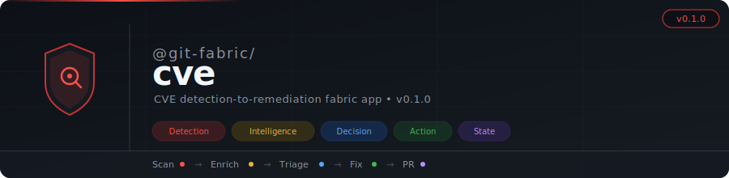

<p align="center">
  
</p>

# @git-fabric/cve

CVE detection-to-remediation fabric app. Scan, enrich, triage, and fix vulnerabilities across managed repos — autonomously.

Part of the [git-fabric](https://github.com/git-fabric) ecosystem.
Built on the [fabric-sdk](https://github.com/git-fabric/sdk) OSI/BGP routing model.

## Architecture

Five composable layers, each independently consumable:

```
Detection  →  Intelligence  →  Decision  →  Action  →  State
   │               │              │            │          │
   │  Scan deps    │  NVD enrich  │  Policy    │  Branch  │  JSONL queue
   │  query GHSA   │  CVSS/CWE    │  triage    │  commit  │  dedup
   │               │              │  plans     │  PR      │  stats
   └───────────────┴──────────────┴────────────┴──────────┴──────────
```

| Layer | What it does | Side effects? |
|-------|-------------|---------------|
| **Detection** | Reads dependency manifests, queries GitHub Advisory Database | No (produces findings) |
| **Intelligence** | Enriches CVEs from NVD with CVSS scores, status, CWE | No (pure data transform) |
| **Decision** | Applies severity policy, produces triage plans | No (pure logic) |
| **Action** | Creates branches, commits dependency bumps, opens PRs | Yes (writes to GitHub) |
| **State** | Manages the CVE queue (JSONL), dedup, filtering, stats | Yes (writes to state repo) |

### OSI Layer Mapping

The pipeline maps to the fabric-sdk OSI model:

```
Layer 7 — Application    app.ts (FabricApp factory, 8 tools)
Layer 6 — Presentation   bin/cli.js (Commander CLI + MCP stdio/HTTP, aiana_query)
Layer 5 — Session        layers/state.ts (JSONL queue, dedup, stats)
Layer 4 — Transport      MCP protocol (stdio + StreamableHTTP)
Layer 3 — Network        Gateway registration (AS65009, fabric.cve.*)
Layer 2 — Data Link      adapters/env.ts (Octokit + NVD API)
Layer 1 — Physical       GitHub API, NVD API
```

## Quick Start

### As an MCP Server (stdio)

```bash
# Set environment
export GITHUB_TOKEN="ghp_..."
export STATE_REPO="ry-ops/git-steer-state"
export MANAGED_REPOS="ry-ops/git-steer,ry-ops/blog"

# Start MCP server (stdio)
npx @git-fabric/cve start
```

### As an HTTP MCP Server

```bash
# Start in HTTP mode with gateway registration
export MCP_HTTP_PORT=8209
export GATEWAY_URL="http://gateway.fabric-sdk:8080"
fabric-cve start
```

When `MCP_HTTP_PORT` is set, the server starts an HTTP listener with the following endpoints:

| Endpoint | Method | Description |
|----------|--------|-------------|
| `/health` | GET | Health check (validates token + state repo) |
| `/tools` | GET | List available tools |
| `/tools/call` | POST | Call a tool by name |
| `/mcp` | POST | StreamableHTTP MCP endpoint |

### Claude Desktop Config

```json
{
  "mcpServers": {
    "git-fabric-cve": {
      "command": "npx",
      "args": ["@git-fabric/cve", "start"],
      "env": {
        "GITHUB_TOKEN": "ghp_...",
        "STATE_REPO": "ry-ops/git-steer-state",
        "MANAGED_REPOS": "ry-ops/git-steer,ry-ops/blog"
      }
    }
  }
}
```

### CLI

```bash
# Scan repos for vulnerable deps
fabric-cve scan --severity-threshold HIGH

# Enrich a single CVE from NVD
fabric-cve enrich CVE-2024-45519

# Triage pending queue entries (dry run)
fabric-cve triage --dry-run true

# Queue operations
fabric-cve queue list --status pending
fabric-cve queue stats
```

## MCP Tools

| Tool | Description |
|------|-------------|
| `cve_scan` | Scan managed repos for vulnerable dependencies via GHSA |
| `cve_enrich` | Fetch enriched details for a CVE from NVD |
| `cve_batch` | Batch enrich and rank multiple CVEs by severity |
| `cve_triage` | Process pending queue entries and open PRs per policy |
| `cve_queue_list` | List queue entries filtered by status/severity |
| `cve_queue_stats` | Queue health dashboard |
| `cve_queue_update` | Manually update entry status (e.g. skip with reason) |
| `cve_compact` | Compact queue by removing resolved entries past retention |

## Gateway Registration

fabric-cve registers as **AS65009** with the fabric-sdk gateway. On startup in HTTP mode, it advertises the following BGP-style route prefixes:

| Route Prefix | Description |
|-------------|-------------|
| `fabric.cve` | CVE detection, enrichment, triage, and remediation |
| `fabric.cve.scan` | Vulnerability scanning — repo dependency analysis via GHSA |
| `fabric.cve.enrich` | CVE enrichment — NVD details, CVSS, CWE, references |
| `fabric.cve.triage` | Triage — severity policy, auto-PR, queue processing |
| `fabric.cve.queue` | Queue management — list, stats, update, compact |
| `fabric.security.vulnerabilities` | Vulnerability intelligence across managed repos |

All routes advertise with `local_pref: 100` (deterministic lane). The gateway uses these prefixes to resolve natural language queries to the correct fabric without calling Claude.

Registration includes a 30-second keepalive interval. If the session expires (401), fabric-cve re-registers automatically.

## aiana_query

The gateway's DNS resolver sends `aiana_query` requests to fabric-cve when a natural language question matches a `fabric.cve.*` prefix. fabric-cve maps these queries to real-time tool calls:

| Natural language pattern | Tools called | Confidence |
|--------------------------|-------------|------------|
| "active CVEs", "pending vulnerabilities" | `cve_queue_stats` + `cve_queue_list` | 0.95 |
| "triage status", "queue dashboard" | `cve_queue_stats` | 0.90 |
| "scan results", "detection findings" | `cve_queue_list` (status: all) | 0.85 |
| "critical findings", "high severity CVEs" | `cve_queue_list` (severity_min: CRITICAL) | 0.90 |
| "PRs opened", "remediation status" | `cve_queue_list` (status: pr_opened) | 0.85 |
| "errors", "failed triage" | `cve_queue_list` (status: error) | 0.85 |
| "health", "API connectivity" | `app.health()` | 0.90 |
| Reference questions ("how to", NVD docs) | Library lookup | 0.60-0.92 |

If no live-data pattern matches, the query falls through to the Library for reference documentation. If the Library also misses, queue stats are returned as a fallback at confidence 0.50.

This keeps the three routing lanes intact: deterministic (>=0.95) answers from live tools, local-llm (>=floor) from Library context, and Claude as the `0.0.0.0/0` default route (last resort).

## Severity Policy

The decision layer applies configurable policy:

| Severity | Default Action | PR Type |
|----------|---------------|---------|
| **CRITICAL** | Auto-PR | Confirmed |
| **HIGH** | Auto-PR | Draft |
| **MEDIUM** | Skip | Manual review |
| **LOW** | Skip | Noise reduction |

Override via CLI flags or MCP tool arguments:

```bash
fabric-cve triage \
  --auto-pr-threshold CRITICAL \
  --max-prs-per-run 3 \
  --require-patched-version true
```

## Library

fabric-cve includes a built-in Library for reference documentation lookups. The Library fetches content on demand from upstream sources — no local copies stored permanently.

| Source | Repository | Description |
|--------|-----------|-------------|
| `github-advisory-database` | [github/advisory-database](https://github.com/github/advisory-database) | GHSA advisories, ecosystem docs |
| `nvd-api` / `vulnrichment` | [cisagov/vulnrichment](https://github.com/cisagov/vulnrichment) | CISA CVE enrichment data, CVSS, CWE |
| `osv-schema` | [ossf/osv-schema](https://github.com/ossf/osv-schema) | Open Source Vulnerability format spec |

The Library is the second knowledge source checked by `aiana_query` — after live tool data but before escalating to Claude. It answers "how to" and "why" questions using upstream reference docs.

## Environment Variables

| Variable | Required | Description |
|----------|----------|-------------|
| `GITHUB_TOKEN` | Yes | GitHub token (or `GIT_STEER_TOKEN`) |
| `STATE_REPO` | Yes | State repo path (e.g. `ry-ops/git-steer-state`) |
| `MANAGED_REPOS` | Yes | Comma-separated repos to manage |
| `NVD_API_KEY` | No | NVD API key (raises rate limit 5 to 50 req/30s) |
| `MCP_HTTP_PORT` | No | Start HTTP server instead of stdio (e.g. `8209`) |
| `GATEWAY_URL` | No | Gateway registration endpoint (e.g. `http://gateway.fabric-sdk:8080`) |
| `POD_IP` | No | Pod IP for gateway `mcp_endpoint` (default: `0.0.0.0`) |
| `OLLAMA_ENDPOINT` | No | Ollama inference endpoint (default: `http://ollama.fabric-sdk:11434`) |
| `OLLAMA_MODEL` | No | Local LLM model for routing (default: `qwen2.5-coder:3b`) |
| `LIBRARY_DIR` | No | Cache directory for Library checkouts (default: `/tmp/fabric-library`) |

## GitHub Actions

Two workflows for autonomous operation:

- **`cve-scan.yml`** — Weekly Monday scan, queries GHSA for all managed repos, queues findings
- **`cve-triage.yml`** — Dispatch-only, reads queue, applies policy, opens PRs

The scan explicitly dispatches triage after completing — no push-trigger race condition.

### Required Secrets & Variables

| Name | Type | Description |
|------|------|-------------|
| `GIT_FABRIC_TOKEN` | Secret | GitHub token with repo + workflow access |
| `NVD_API_KEY` | Secret | NVD API key (optional, raises rate limit 5→50 req/30s) |
| `STATE_REPO` | Variable | State repo path (e.g. `ry-ops/git-steer-state`) |
| `MANAGED_REPOS` | Variable | Comma-separated repos to manage |

## Consuming from git-steer

git-steer can delegate to the fabric by implementing the `GitHubAdapter` and `StateAdapter` interfaces:

```typescript
import { layers } from "@git-fabric/cve";

// Detection
const result = await layers.detection.detect(repos, "HIGH", githubAdapter);

// Queue
await layers.state.enqueue(result.findings, stateAdapter);

// Triage
const pending = await layers.state.pending(stateAdapter);
const plans = layers.decision.triage(pending, policy);
const results = await layers.action.execute(plans, githubAdapter);
```

## Project Structure

```
src/
├── types.ts              # Shared types + adapter interfaces
├── index.ts              # Barrel export
├── app.ts                # FabricApp factory (8 tools, health check)
├── library.ts            # Reference doc retrieval (GHSA, NVD, OSV)
├── layers/
│   ├── detection.ts      # GHSA scanning + manifest parsing
│   ├── intelligence.ts   # NVD enrichment
│   ├── decision.ts       # Severity policy engine
│   ├── action.ts         # Branch + commit + PR creation
│   └── state.ts          # JSONL queue management
├── mcp/
│   └── server.ts         # MCP server (stdio, 7 tools)
└── adapters/
    └── env.ts            # Env var → Octokit + NVD adapter
bin/
└── cli.js                # Commander CLI + MCP stdio/HTTP + aiana_query
```

## License

MIT
